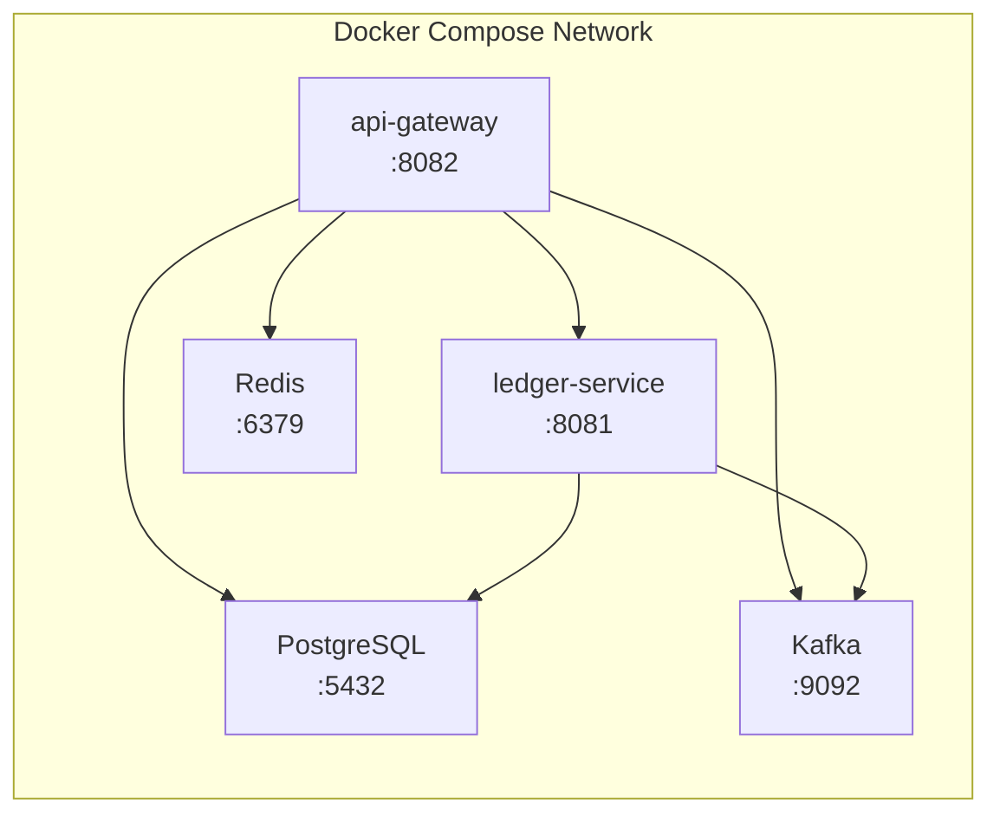
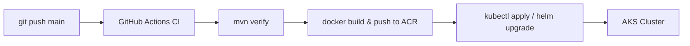

# CI/CD & Deployment Analysis — Ledger Project

## Current State: What You Have

### ✅ What Exists

| Layer | What You Have | File |
|---|---|---|
| **Containerization** | Dockerfiles for both services | [ledger-service/Dockerfile](file:///c:/Users/Chamod/Documents/Personal%20Projects/Ledger%20Final/ledger-service/Dockerfile), [api-gateway/Dockerfile](file:///c:/Users/Chamod/Documents/Personal%20Projects/Ledger%20Final/api-gateway/Dockerfile) |
| **Local Orchestration** | Docker Compose with all 5 services | [docker-compose.yml](file:///c:/Users/Chamod/Documents/Personal%20Projects/Ledger%20Final/docker-compose.yml) |
| **DB Initialization** | SQL init script auto-run on startup | [db-init/init.sql](file:///c:/Users/Chamod/Documents/Personal%20Projects/Ledger%20Final/db-init/init.sql) |
| **Infrastructure as Code** | Azure Bicep template (ACR + AKS) | [deployment/main.bicep](file:///c:/Users/Chamod/Documents/Personal%20Projects/Ledger%20Final/deployment/main.bicep) |

### Architecture Summary (Docker Compose)



**Services orchestrated:**
1. **PostgreSQL 15** — Durable source of truth with health checks
2. **Redis 7** — Cache / idempotency layer
3. **Kafka 3.7** — Event streaming (KRaft mode, no Zookeeper)
4. **ledger-service** (:8081) — Core financial ledger
5. **api-gateway** (:8082) — Entry point with Redis idempotency

### ❌ What's Missing

| Layer | Status | Impact |
|---|---|---|
| **CI Pipeline** | ❌ No GitHub Actions / GitLab CI / Jenkins | No automated build, test, or lint on push |
| **CD Pipeline** | ❌ No automated deployment | Manual `docker-compose up` only |
| **Container Registry Push** | ❌ No automated image push | Bicep defines ACR but nothing pushes to it |
| **Kubernetes Manifests** | ❌ No k8s YAML / Helm charts | Bicep creates AKS but nothing to deploy onto it |
| **Multi-stage Dockerfiles** | ❌ Single-stage JRE only | Requires pre-built JAR locally before `docker build` |
| **Environment/Secrets Mgmt** | ❌ Hardcoded passwords in compose | Not production-safe |
| **Health checks** | ⚠️ Partial — only Postgres | Redis, Kafka, app services lack health checks |
| **Observability** | ❌ No Prometheus / Grafana / tracing | No monitoring in deployment |

---

## Dockerfile Observations

Both Dockerfiles are **single-stage, JRE-only**:

```dockerfile
FROM eclipse-temurin:17-jre-alpine
WORKDIR /app
COPY ledger-service/target/*.jar app.jar
EXPOSE 8081
ENTRYPOINT ["java", "-jar", "app.jar"]
```

> [!WARNING]
> This requires you to run `mvn package` locally *before* `docker build`. If you forget, the build context won't have a JAR and the build fails silently or copies nothing.

---

## Bicep IaC Observations

The [main.bicep](file:///c:/Users/Chamod/Documents/Personal%20Projects/Ledger%20Final/deployment/main.bicep) provisions:
- **Azure Container Registry (ACR)** — Standard SKU, admin enabled
- **Azure Kubernetes Service (AKS)** — 1 node, `Standard_DS2_v2`

> [!IMPORTANT]
> This is a **skeleton**. It creates the infrastructure but has no:
> - Kubernetes manifests to deploy your services
> - Managed PostgreSQL, Redis, or Kafka (Event Hubs) resources
> - Networking, ingress, or TLS configuration
> - Role assignments to let AKS pull from ACR

---

## Deployment Roadmap

Here's a phased roadmap, ordered from **highest impact** to **production-grade**:

### Phase 1 — Fix the Foundation (Local Dev) 🔧

**Goal:** Make local dev reliable and repeatable.

| Task | Why It Matters |
|---|---|
| **Multi-stage Dockerfiles** | Build JAR *inside* Docker — no local Maven needed. Reproducible builds. |
| **Health checks for all services** | `depends_on: condition: service_healthy` for Redis, Kafka, and app services |
| **Externalize secrets** | Use `.env` file for compose (not hardcoded passwords) |
| **Add `docker-compose.override.yml`** | Dev-specific overrides (volumes for hot-reload, debug ports) |

**Multi-stage Dockerfile example:**
```dockerfile
# Stage 1: Build
FROM eclipse-temurin:17-jdk-alpine AS builder
WORKDIR /app
COPY pom.xml .
COPY ledger-service/pom.xml ledger-service/
COPY ledger-service/src ledger-service/src
RUN ./mvnw -pl ledger-service -am package -DskipTests

# Stage 2: Run
FROM eclipse-temurin:17-jre-alpine
WORKDIR /app
COPY --from=builder /app/ledger-service/target/*.jar app.jar
EXPOSE 8081
ENTRYPOINT ["java", "-jar", "app.jar"]
```

---

### Phase 2 — CI Pipeline (Automated Build + Test) 🔄

**Goal:** Every push triggers build → test → report.

| Task | Tool |
|---|---|
| **GitHub Actions workflow** | `.github/workflows/ci.yml` |
| **Steps:** checkout → build → test → lint → report | Maven + JUnit |
| **Branch protection** | Require CI pass before merge |

**Workflow skeleton:**
```yaml
# .github/workflows/ci.yml
name: CI
on: [push, pull_request]
jobs:
  build-and-test:
    runs-on: ubuntu-latest
    steps:
      - uses: actions/checkout@v4
      - uses: actions/setup-java@v4
        with: { distribution: temurin, java-version: 17 }
      - run: ./mvnw verify
      - uses: actions/upload-artifact@v4
        with:
          name: test-reports
          path: "**/target/surefire-reports/"
```

---

### Phase 3 — CD Pipeline (Automated Deployment) 🚀

**Goal:** Merge to `main` → build images → push to registry → deploy.

| Task | Details |
|---|---|
| **Build & push images to ACR** | On merge to `main`, build multi-stage, tag with `sha` and `latest` |
| **Create Kubernetes manifests** | Deployments, Services, ConfigMaps, Secrets for all 5 services |
| **Automated deploy to AKS** | `kubectl apply` or Helm upgrade in CI |



---

### Phase 4 — Production Infrastructure ☁️

**Goal:** Managed services, proper networking, security.

| Task | Azure Service |
|---|---|
| **Managed PostgreSQL** | Azure Database for PostgreSQL Flexible Server |
| **Managed Redis** | Azure Cache for Redis |
| **Managed Kafka** | Azure Event Hubs (Kafka protocol) |
| **Ingress + TLS** | NGINX Ingress Controller + cert-manager |
| **Secrets** | Azure Key Vault + CSI driver |
| **DNS** | Azure DNS zone + external-dns |

Update [main.bicep](file:///c:/Users/Chamod/Documents/Personal%20Projects/Ledger%20Final/deployment/main.bicep) to provision all of these.

---

### Phase 5 — Observability & Reliability 📊

**Goal:** Know when things break *before* users tell you.

| Task | Tool |
|---|---|
| **Metrics** | Prometheus + Grafana (or Azure Monitor) |
| **Distributed Tracing** | OpenTelemetry → Jaeger (or Application Insights) |
| **Structured Logging** | Logback JSON → Loki (or Log Analytics) |
| **Alerting** | Grafana alerts / Azure Alerts |
| **Health endpoints** | Spring Boot Actuator `/actuator/health` |
| **Liveness/Readiness probes** | Kubernetes probe config pointing to Actuator |

---

### Phase 6 — Production Hardening 🛡️

| Task | Why |
|---|---|
| **Rolling deployments** | Zero-downtime deploys |
| **Resource limits** | Prevent one pod from starving the cluster |
| **Network policies** | Only api-gateway talks to the internet |
| **Pod disruption budgets** | Safe node maintenance |
| **Backup strategy** | Automated PostgreSQL backups |
| **Disaster recovery runbook** | Documented recovery procedures |
| **Load testing** | Verify throughput under stress (k6, Gatling) |

---

## Summary: Where You Are on the Journey

```
[You Are Here]
      ↓
 ┌─────────────────────────────────────────────────────┐
 │  ✅ Phase 0: Containerization + Local Compose       │ ← DONE
 │  🔧 Phase 1: Fix Foundation (multi-stage, secrets)  │ ← NEXT
 │  🔄 Phase 2: CI Pipeline (GitHub Actions)           │
 │  🚀 Phase 3: CD Pipeline (ACR + AKS deploy)         │
 │  ☁️  Phase 4: Production Infrastructure (managed)    │
 │  📊 Phase 5: Observability                          │
 │  🛡️  Phase 6: Production Hardening                   │
 └─────────────────────────────────────────────────────┘
```

> [!TIP]
> **Biggest bang for your buck right now:** Fix the Dockerfiles to multi-stage (Phase 1) and add a GitHub Actions CI workflow (Phase 2). These two changes alone take you from "works on my machine" to "automated, reproducible builds."
