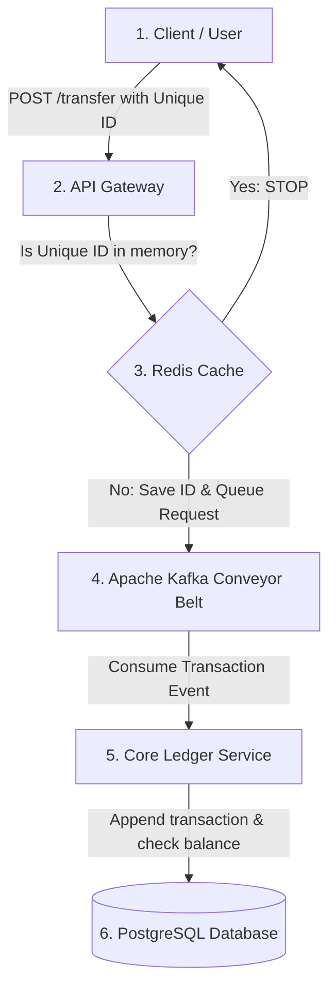

# Step-by-Step Implementation Guide: High-Throughput Financial Ledger Microservice

Welcome! This guide is designed for anyone, **even with zero prior programming experience**, to build and run this financial ledger microservice. 

Think of this system as a high-speed, digital bank vault. We will build it step by step, starting with installing the necessary tools on your computer, setting up the digital infrastructure (like databases and message queues), writing the code, and finally running it.

---

## 🛠️ Step 1: Install the Tools
Before we write any code, we need to install the software that developers use to write, run, and test code.

### 1. Java Development Kit (JDK 17)
Java is the programming language we will use. The JDK is the engine that compiles and runs Java code.
* **Download:** Go to [Adoptium Eclipse Temurin](https://adoptium.net/temurin/releases/?version=17) and download the installer for Windows.
* **Install:** Run the installer and click "Next" through all defaults. Make sure the option to **"Add to PATH"** is checked.

### 2. Docker Desktop
Our application relies on other services: a database (PostgreSQL), a fast cache (Redis), and a message broker (Kafka). Instead of installing these directly on your computer (which is complicated), we use **Docker**. Docker packages these services into "containers" that run isolated on your system.
* **Download:** Go to [Docker Desktop](https://www.docker.com/products/docker-desktop/) and download for Windows.
* **Install:** Run the installer. You may be prompted to enable WSL 2 (Windows Subsystem for Linux); follow the prompts and restart your computer if asked. Once installed, start the Docker Desktop app.

### 3. Integrated Development Environment (IntelliJ IDEA Community Edition)
An IDE is a advanced text editor designed for writing code.
* **Download:** Go to [IntelliJ IDEA Download](https://www.jetbrains.com/idea/download/#section=windows) and scroll down to download the free **Community Edition**.
* **Install:** Run the installer and accept the default settings.

### 4. Git
Git is a version control system that tracks changes in code.
* **Download:** Go to [Git for Windows](https://git-scm.com/download/win) and download the installer.
* **Install:** Run the installer and click "Next" through the defaults.

---

## 🏗️ Step 2: System Architecture (In Plain English)

Before we start coding, let's understand how our system works:



1. **Client (You / Postman):** Sends a request to transfer money. It includes a unique string called an `Idempotency Key` (like a receipt ID).
2. **API Gateway:** The front desk. It receives the request and checks Redis to see if we've already processed this receipt ID.
3. **Redis:** A super-fast notepad. If the receipt ID is already there, we reject the request (prevents double-spending). If not, we write it down.
4. **Apache Kafka:** A digital conveyor belt. The Gateway drops the transaction onto the belt and immediately tells the client, *"We received your request, we are processing it!"* (This is why it's high-throughput: the client doesn't wait for the database).
5. **Core Ledger Service:** Works in the background. It takes transactions off the conveyor belt one by one.
6. **PostgreSQL Database:** The permanent ledger book. The Ledger Service reads the account balance, verifies there is enough money, and writes down the transaction.

---

## 📂 Step 3: Set Up Your Project Folder
Let's create the folder structure.

1. Open your file explorer and create a folder named `ledger-microservice` in your preferred workspace directory (e.g. `C:\Projects\ledger-microservice`).
2. Inside that folder, create the following subfolders and empty files:
   ```text
   ledger-microservice/
   │
   ├── docker-compose.yml             <-- (Tells Docker to run Postgres, Redis, Kafka)
   │
   ├── db-init/
   │   └── init.sql                   <-- (Sets up the database tables)
   │
   ├── api-gateway/                   <-- (Folder for our API Gateway code)
   │   ├── pom.xml
   │   └── src/main/java/com/ledger/gateway/GatewayApplication.java
   │
   └── ledger-service/                <-- (Folder for our Core Ledger code)
       ├── pom.xml
       └── src/main/java/com/ledger/core/LedgerApplication.java
   ```

---

## 🐳 Step 4: Configure the Infrastructure (Docker)

We will configure Docker to start our database, cache, and message queue. 

Open your folder in IntelliJ IDEA (File -> Open -> Select `ledger-microservice` folder). Create a file named `docker-compose.yml` in the root folder and paste the following:

```yaml
version: '3.8'

services:
  # 1. PostgreSQL Database
  postgres:
    image: postgres:15-alpine
    container_name: ledger-postgres
    ports:
      - "5432:5432"
    environment:
      POSTGRES_USER: ledger_user
      POSTGRES_PASSWORD: ledger_password
      POSTGRES_DB: ledger_db
    volumes:
      - ./db-init:/docker-entrypoint-initdb.d
      - postgres_data:/var/lib/postgresql/data

  # 2. Redis Cache (for Idempotency)
  redis:
    image: redis:7-alpine
    container_name: ledger-redis
    ports:
      - "6379:6379"

  # 3. Kafka Broker (Message Queue)
  kafka:
    image: ubuntu/kafka:latest
    container_name: ledger-kafka
    ports:
      - "9092:9092"
    environment:
      - KAFKA_CFG_NODE_ID=0
      - KAFKA_CFG_PROCESS_ROLES=controller,broker
      - KAFKA_CFG_LISTENERS=PLAINTEXT://:9092,CONTROLLER://:9093
      - KAFKA_CFG_ADVERTISED_LISTENERS=PLAINTEXT://localhost:9092
      - KAFKA_CFG_LISTENER_SECURITY_PROTOCOL_MAP=CONTROLLER:PLAINTEXT,PLAINTEXT:PLAINTEXT
      - KAFKA_CFG_CONTROLLER_QUORUM_VOTERS=0@localhost:9093
      - KAFKA_CFG_CONTROLLER_LISTENER_NAMES=CONTROLLER

volumes:
  postgres_data:
```

### Create the Database Setup Script
Create a folder named `db-init` and create a file inside it named `init.sql`. Paste this SQL code, which creates our database tables automatically when PostgreSQL starts:

```sql
-- Create Accounts Table
CREATE TABLE accounts (
    id VARCHAR(255) PRIMARY KEY,
    balance DECIMAL(15, 2) NOT NULL DEFAULT 0.00,
    currency VARCHAR(3) NOT NULL,
    version INT NOT NULL DEFAULT 0 -- Used for Optimistic Concurrency Control
);

-- Create Ledger Events Table (Event Sourcing)
CREATE TABLE ledger_events (
    id SERIAL PRIMARY KEY,
    account_id VARCHAR(255) NOT NULL,
    amount DECIMAL(15, 2) NOT NULL,
    currency VARCHAR(3) NOT NULL,
    transaction_type VARCHAR(50) NOT NULL, -- DEPOSIT or WITHDRAWAL
    idempotency_key VARCHAR(255) UNIQUE NOT NULL,
    created_at TIMESTAMP WITH TIME ZONE DEFAULT CURRENT_TIMESTAMP
);

-- Pre-populate some demo accounts
INSERT INTO accounts (id, balance, currency, version) VALUES
('acc_john_123', 1000.00, 'USD', 0),
('acc_jane_456', 500.00, 'USD', 0);
```

---

## ⚡ Step 5: Build the API Gateway

The API Gateway is the outer wall of our system. It accepts transfer requests, checks Redis to make sure the request is not a duplicate, and publishes it to Kafka.

### 1. Create the `api-gateway/pom.xml`
This file tells Java what dependencies (libraries) to download. Paste this content:

```xml
<?xml version="1.0" encoding="UTF-8"?>
<project xmlns="http://maven.apache.org/POM/4.0.0" 
         xmlns:xsi="http://www.w3.org/2001/XMLSchema-instance"
         xsi:schemaLocation="http://maven.apache.org/POM/4.0.0 https://maven.apache.org/xsd/maven-4.0.0.xsd">
    <modelVersion>4.0.0</modelVersion>
    
    <groupId>com.ledger</groupId>
    <artifactId>api-gateway</artifactId>
    <version>1.0.0</version>
    
    <parent>
        <groupId>org.springframework.boot</groupId>
        <artifactId>spring-boot-starter-parent</artifactId>
        <version>3.1.5</version>
    </parent>

    <properties>
        <java.version>17</java.version>
    </properties>

    <dependencies>
        <dependency>
            <groupId>org.springframework.boot</groupId>
            <artifactId>spring-boot-starter-web</artifactId>
        </dependency>
        <dependency>
            <groupId>org.springframework.boot</groupId>
            <artifactId>spring-boot-starter-data-redis</artifactId>
        </dependency>
        <dependency>
            <groupId>org.springframework.kafka</groupId>
            <artifactId>spring-kafka</artifactId>
        </dependency>
    </dependencies>
</project>
```

### 2. Configure `api-gateway/src/main/resources/application.properties`
Create this file to tell the Gateway how to find Redis and Kafka:
```properties
server.port=8080
spring.data.redis.host=localhost
spring.data.redis.port=6379
spring.kafka.bootstrap-servers=localhost:9092
```

### 3. Create `api-gateway/src/main/java/com/ledger/gateway/GatewayApplication.java`
Paste this Java code, which is the actual Gateway program:

```java
package com.ledger.gateway;

import org.springframework.boot.SpringApplication;
import org.springframework.boot.autoconfigure.SpringBootApplication;
import org.springframework.data.redis.core.StringRedisTemplate;
import org.springframework.kafka.core.KafkaTemplate;
import org.springframework.web.bind.annotation.*;
import org.springframework.http.ResponseEntity;
import org.springframework.http.HttpStatus;
import com.fasterxml.jackson.databind.ObjectMapper;
import java.math.BigDecimal;

import java.time.Duration;
import java.util.Map;
import java.util.UUID;

@SpringBootApplication
public class GatewayApplication {
    public static void main(String[] args) {
        SpringApplication.run(GatewayApplication.class, args);
    }
}

// Data format representing the JSON incoming request
class TransferRequest {
    public String accountId;
    public BigDecimal amount;
    public String currency;
    public String transactionType;
}

@RestController
@RequestMapping("/api/v1/ledger")
class GatewayController {

    private final StringRedisTemplate redisTemplate;
    private final KafkaTemplate<String, String> kafkaTemplate;
    private final ObjectMapper objectMapper;

    public GatewayController(StringRedisTemplate redisTemplate, KafkaTemplate<String, String> kafkaTemplate, ObjectMapper objectMapper) {
        this.redisTemplate = redisTemplate;
        this.kafkaTemplate = kafkaTemplate;
        this.objectMapper = objectMapper;
    }

    @PostMapping("/transfer")
    public ResponseEntity<Object> processTransfer(
            @RequestHeader("X-Idempotency-Key") String idempotencyKey,
            @RequestBody TransferRequest request) {

        // 1. Validation
        if (idempotencyKey == null || idempotencyKey.trim().isEmpty()) {
            return ResponseEntity.badRequest().body(Map.of("error", "MISSING_IDEMPOTENCY_KEY"));
        }

        // 2. Redis Idempotency Check
        // Set a key in Redis. If it returns false, the key already existed!
        Boolean isUnique = redisTemplate.opsForValue().setIfAbsent(
                "idempotency:" + idempotencyKey, 
                "processing", 
                Duration.ofHours(24) // Remember this key for 24 hours
        );

        if (Boolean.FALSE.equals(isUnique)) {
            return ResponseEntity.status(HttpStatus.CONFLICT).body(Map.of(
                    "error", "DUPLICATE_REQUEST",
                    "message", "Transaction with this key is already processed or being processed."
            ));
        }

        // 3. Serialize and publish event to Kafka
        try {
            Map<String, Object> eventPayloadMap = Map.of(
                    "idempotencyKey", idempotencyKey,
                    "accountId", request.accountId,
                    "amount", request.amount,
                    "currency", request.currency,
                    "transactionType", request.transactionType
            );
            String eventPayload = objectMapper.writeValueAsString(eventPayloadMap);
            kafkaTemplate.send("ledger-transactions", request.accountId, eventPayload);
        } catch (Exception e) {
            return ResponseEntity.internalServerError().body(Map.of("error", "Failed to serialize event"));
        }

        // 4. Respond instantly with 202 Accepted
        return ResponseEntity.accepted().body(Map.of(
                "transactionId", UUID.randomUUID().toString(),
                "status", "QUEUED",
                "message", "Transaction accepted for processing"
        ));
    }
}
```

---

## ⚙️ Step 6: Build the Core Ledger Service

This background service listens to Kafka, reads transaction events, and records them in PostgreSQL using **Event Sourcing** and **Optimistic Concurrency Control (OCC)**.

### 1. Create the `ledger-service/pom.xml`
Paste this content:

```xml
<?xml version="1.0" encoding="UTF-8"?>
<project xmlns="http://maven.apache.org/POM/4.0.0" 
         xmlns:xsi="http://www.w3.org/2001/XMLSchema-instance"
         xsi:schemaLocation="http://maven.apache.org/POM/4.0.0 https://maven.apache.org/xsd/maven-4.0.0.xsd">
    <modelVersion>4.0.0</modelVersion>
    
    <groupId>com.ledger</groupId>
    <artifactId>ledger-service</artifactId>
    <version>1.0.0</version>
    
    <parent>
        <groupId>org.springframework.boot</groupId>
        <artifactId>spring-boot-starter-parent</artifactId>
        <version>3.1.5</version>
    </parent>

    <properties>
        <java.version>17</java.version>
    </properties>

    <dependencies>
        <dependency>
            <groupId>org.springframework.boot</groupId>
            <artifactId>spring-boot-starter-data-jpa</artifactId>
        </dependency>
        <dependency>
            <groupId>org.postgresql</groupId>
            <artifactId>postgresql</artifactId>
            <scope>runtime</scope>
        </dependency>
        <dependency>
            <groupId>org.springframework.kafka</groupId>
            <artifactId>spring-kafka</artifactId>
        </dependency>
        <dependency>
            <groupId>com.fasterxml.jackson.core</groupId>
            <artifactId>jackson-databind</artifactId>
        </dependency>
    </dependencies>
</project>
```

### 2. Configure `ledger-service/src/main/resources/application.properties`
Tell the Ledger service how to talk to PostgreSQL and Kafka:
```properties
server.port=8081
spring.datasource.url=jdbc:postgresql://localhost:5432/ledger_db
spring.datasource.username=ledger_user
spring.datasource.password=ledger_password
spring.jpa.hibernate.ddl-auto=none
spring.kafka.bootstrap-servers=localhost:9092
spring.kafka.consumer.group-id=ledger-group
```

### 3. Create `ledger-service/src/main/java/com/ledger/core/LedgerApplication.java`
Paste this code, which parses transactions from Kafka, updates PostgreSQL balances, and registers the transactions:

```java
package com.ledger.core;

import com.fasterxml.jackson.databind.ObjectMapper;
import jakarta.persistence.*;
import org.springframework.boot.SpringApplication;
import org.springframework.boot.autoconfigure.SpringBootApplication;
import org.springframework.kafka.annotation.KafkaListener;
import org.springframework.stereotype.Service;
import org.springframework.transaction.annotation.Transactional;
import org.slf4j.Logger;
import org.slf4j.LoggerFactory;

import java.math.BigDecimal;

@SpringBootApplication
public class LedgerApplication {
    public static void main(String[] args) {
        SpringApplication.run(LedgerApplication.class, args);
    }
}

// 1. Account Database Entity (Mapped to PostgreSQL 'accounts' table)
@Entity
@Table(name = "accounts")
class Account {
    @Id
    public String id;
    public BigDecimal balance;
    public String currency;
    
    @Version // Mapped for Optimistic Concurrency Control (OCC)
    public int version;
}

// 2. LedgerEvent Database Entity (Mapped to PostgreSQL 'ledger_events' table)
@Entity
@Table(name = "ledger_events")
class LedgerEvent {
    @Id
    @GeneratedValue(strategy = GenerationType.IDENTITY)
    public Long id;
    
    @Column(name = "account_id")
    public String accountId;
    public BigDecimal amount;
    public String currency;
    
    @Column(name = "transaction_type")
    public String transactionType;
    
    @Column(name = "idempotency_key", unique = true)
    public String idempotencyKey;
}

// Transaction data helper mapping
class TransactionEvent {
    public String idempotencyKey;
    public String accountId;
    public BigDecimal amount;
    public String currency;
    public String transactionType;
}

// Interfaces to let Spring communicate with the DB
interface AccountRepository extends org.springframework.data.repository.CrudRepository<Account, String> {}
interface LedgerEventRepository extends org.springframework.data.repository.CrudRepository<LedgerEvent, Long> {}

// 3. Core Business Logic Service
@Service
class LedgerProcessor {

    private final AccountRepository accountRepository;
    private final LedgerEventRepository eventRepository;
    private final ObjectMapper objectMapper = new ObjectMapper();
    private static final Logger log = LoggerFactory.getLogger(LedgerProcessor.class);

    public LedgerProcessor(AccountRepository accountRepository, LedgerEventRepository eventRepository) {
        this.accountRepository = accountRepository;
        this.eventRepository = eventRepository;
    }

    // Listens to the Kafka Conveyor Belt
    @KafkaListener(topics = "ledger-transactions", groupId = "ledger-group")
    @Transactional // Ensures ACID compliance
    public void processTransaction(String message) {
        try {
            // Parse JSON message from Kafka
            TransactionEvent event = objectMapper.readValue(message, TransactionEvent.class);
            log.info("Processing event: {} for account {}", event.idempotencyKey, event.accountId);

            // Fetch current account status from DB
            Account account = accountRepository.findById(event.accountId)
                    .orElseThrow(() -> new IllegalArgumentException("Account not found: " + event.accountId));

            BigDecimal transactionAmount = event.amount;

            // Calculate new balances based on Event Type
            if ("WITHDRAWAL".equalsIgnoreCase(event.transactionType)) {
                if (account.balance.compareTo(transactionAmount) < 0) {
                    log.warn("INSUFFICIENT FUNDS: Account {} attempted to withdraw {}", event.accountId, transactionAmount);
                    return; // Reject transaction (No balance update, event not appended)
                }
                account.balance = account.balance.subtract(transactionAmount);
            } else if ("DEPOSIT".equalsIgnoreCase(event.transactionType)) {
                account.balance = account.balance.add(transactionAmount);
            } else {
                log.warn("UNKNOWN TRANSACTION TYPE: {}", event.transactionType);
                return;
            }

            // Save balance update (OCC check happens here on version column)
            accountRepository.save(account);

            // Save immutable Event Log (Audit trail)
            LedgerEvent ledgerEvent = new LedgerEvent();
            ledgerEvent.accountId = event.accountId;
            ledgerEvent.amount = transactionAmount;
            ledgerEvent.currency = event.currency;
            ledgerEvent.transactionType = event.transactionType;
            ledgerEvent.idempotencyKey = event.idempotencyKey;
            
            eventRepository.save(ledgerEvent);
            log.info("Successfully recorded transaction. New balance: {}", account.balance);

        } catch (Exception e) {
            log.error("Failed to process transaction event: {}", e.getMessage(), e);
            // In a production system, failed messages would go to a Dead Letter Queue (DLQ) for retries
        }
    }
}
```

---

## 🚀 Step 7: How to Start and Run Everything

Now that all our pieces are in place, let's turn them on!

### Step 7.1: Start Infrastructure (Docker)
1. Open your terminal (IntelliJ terminal or command prompt) at the root of `ledger-microservice`.
2. Run the command:
   ```bash
   docker-compose up -d
   ```
3. Open Docker Desktop. You should see three containers running: `ledger-postgres`, `ledger-redis`, and `ledger-kafka`.

### Step 7.2: Run the API Gateway
1. In IntelliJ, open `GatewayApplication.java`.
2. Click the green play icon ▶️ next to `public class GatewayApplication` or `main` method and select **Run 'GatewayApplication'**.
3. It will download the packages and start. You will see a log line in the console indicating it's listening on port `8080`.

### Step 7.3: Run the Core Ledger Service
1. Open `LedgerApplication.java`.
2. Click the green play icon ▶️ next to `public class LedgerApplication` and select **Run 'LedgerApplication'**.
3. It will start and begin listening to Kafka.

---

## 🧪 Step 8: Verify It Works (Testing Your Microservice)

We will simulate a client sending a transaction to make sure the money is deducted from John's account.

We will use a utility called `curl` (which is built into Windows Powershell and Command Prompt).

### Test 1: Send a withdrawal request
Open a Command Prompt or Powershell window and paste this request to withdraw **$50.00** from John's account (`acc_john_123`). 

Notice the header `-H "X-Idempotency-Key: txn_unique_001"`. This acts as our unique receipt code.

```bash
curl -X POST http://localhost:8080/api/v1/ledger/transfer `
  -H "Content-Type: application/json" `
  -H "X-Idempotency-Key: txn_unique_001" `
  -d "{\"accountId\": \"acc_john_123\", \"amount\": 50.00, \"currency\": \"USD\", \"transactionType\": \"WITHDRAWAL\"}"
```
*(Note: If using standard CMD instead of PowerShell, replace the backticks `` ` `` at the end of lines with `^` or write the command in a single line).*

**Expected Response:**
```json
{"transactionId":"...","status":"QUEUED","message":"Transaction accepted for processing"}
```
Now check the terminal logs of your **LedgerApplication**. You should see:
```text
Processing event: txn_unique_001 for account acc_john_123
Successfully recorded transaction. New balance: 950.00
```

---

### Test 2: Double-Spend Protection (Idempotency check)
Send the exact same command *again* with the same `X-Idempotency-Key: txn_unique_001`:

```bash
curl -X POST http://localhost:8080/api/v1/ledger/transfer `
  -H "Content-Type: application/json" `
  -H "X-Idempotency-Key: txn_unique_001" `
  -d "{\"accountId\": \"acc_john_123\", \"amount\": 50.00, \"currency\": \"USD\", \"transactionType\": \"WITHDRAWAL\"}"
```

**Expected Response:**
```json
HTTP/1.1 409 Conflict
{
  "error": "DUPLICATE_REQUEST",
  "message": "Transaction with this key is already processed or being processed."
}
```
**Why this is amazing:** Our code blocked a double charge instantly using Redis, before it ever reached the database!

---

### Test 3: Insufficient Funds Verification
Now, let's try to withdraw **$2000.00** from John's account (who now has $950.00 left). Use a *new* idempotency key `txn_unique_002` so it doesn't get blocked:

```bash
curl -X POST http://localhost:8080/api/v1/ledger/transfer `
  -H "Content-Type: application/json" `
  -H "X-Idempotency-Key: txn_unique_002" `
  -d "{\"accountId\": \"acc_john_123\", \"amount\": 2000.00, \"currency\": \"USD\", \"transactionType\": \"WITHDRAWAL\"}"
```

**Expected Response:**
The Gateway returns `202 Accepted` because it queues requests without blocking.
However, look at your **LedgerApplication** console logs:
```text
Processing event: txn_unique_002 for account acc_john_123
INSUFFICIENT FUNDS: Account acc_john_123 attempted to withdraw 2000.00
```
The transaction is rejected by the processor, keeping John's balance safely at $950.00.

---

## 🎉 Congratulations!
You have successfully implemented a highly concurrent, fault-tolerant financial ledger system! You now understand how large tech giants like Stripe and PayPal architect their systems for maximum speed, security, and accuracy.
