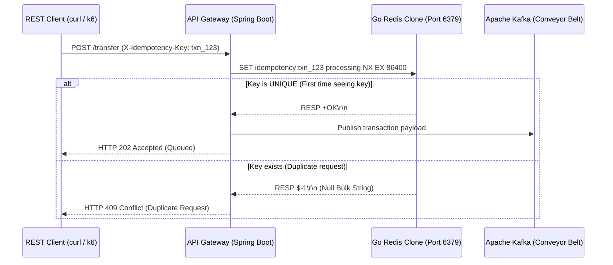

# Specification: Integrating Go Redis Clone with Ledger Microservice

This document defines the minimal subset of Redis protocol features, command behaviors, and architectural capabilities required for the Go Redis clone to successfully back the High-Throughput Financial Ledger Microservice.

Since this integration is for educational validation, the Go Redis clone does not need to support all Redis features. It must strictly implement the requirements detailed below.

---

## 1. System Integration Flow

The API Gateway in the Ledger Microservice uses Redis as an **Idempotency Filter** to prevent duplicate transaction execution (double-spending).



---

## 2. Technical Requirements Checklist

### A. Network & Concurrency
* **TCP Port Binding:** Must bind to `0.0.0.0:6379`.
* **Multi-Client Concurrency:** Must spawn a separate goroutine for each accepted TCP connection to support Spring Boot's concurrent connection pooling.
  ```go
  // Required socket loop pattern
  for {
      conn, err := listener.Accept()
      if err == nil {
          go handleConnection(conn) // Concurrency wrapper
      }
  }
  ```
* **Graceful Disconnection:** Cleanly handle `io.EOF` (end-of-file) when a client closes a connection, preventing server panics.

### B. Core Command Set Required

#### 1. `PING`
* **Purpose:** Connection health check by the Lettuce client library.
* **Request:** `PING`
* **Response:** `+PONG\r\n`

#### 2. `SET key value [NX] [EX seconds] [PX milliseconds]`
* **Purpose:** Idempotency tracking and automatic key eviction.
* **Behavior:**
  * **Option `NX` (Not Exists):**
    * If the key already exists: **Do not update** and return a **Null Bulk String** (`$-1\r\n`).
    * If the key does not exist: Save key/value, start expiration tracker, and return `+OK\r\n`.
  * **Option `EX` / `PX`:** Parse expiration duration and automatically delete the key after the timeout expires.

#### 3. Fallback for Metadata Commands
* **Purpose:** The Lettuce client executes configuration and metadata checks (like `COMMAND`, `CLIENT`, `HELLO`) upon connecting.
* **Behavior:** Instead of returning empty simple strings, the clone must return a standard RESP error frame when encountering unknown commands. This allows the client library to gracefully degrade instead of crashing on protocol parsing.
* **Response format:** `-ERR unknown command '<command_name>'\r\n`

---

## 3. Storage & TTL (Time To Live) Engine

### Data Structure
The in-memory storage map must support storing both the string value and an absolute expiration time:

```go
type StorageEntry struct {
    Value      string
    ExpiresAt  time.Time // Set to zero time if key never expires
}

var SETs = map[string]StorageEntry{}
var SETsMu sync.RWMutex
```

### TTL Eviction Mechanisms
To prevent memory exhaustion, implement a combined eviction policy:

1. **Passive Eviction (On-Read):**
   When `GET` or `SET` is called on a key, check if `time.Now().After(entry.ExpiresAt)`. If true, delete the key from the map and treat the request as a cache miss.
2. **Active Eviction (Background Sweeper):**
   A background goroutine that runs every few seconds to clean up expired keys:
   ```go
   go func() {
       for {
           time.Sleep(5 * time.Second)
           SETsMu.Lock()
           for key, entry := range SETs {
               if !entry.ExpiresAt.IsZero() && time.Now().After(entry.ExpiresAt) {
                   delete(SETs, key)
               }
           }
           SETsMu.Unlock()
       }
   }()
   ```

---

## 4. Integration Verification Steps

Once these changes are implemented:

1. Stop the official Redis instance:
   ```powershell
   docker-compose down redis
   ```
2. Start your Go Redis clone listening on port `6379`.
3. Boot the API Gateway and verify in console logs that the connection is established successfully without handshake failures.
4. Send a transaction request and verify that the clone returns `+OK\r\n` and logs the idempotency key.
5. Re-send the exact request and verify that the API Gateway returns `409 Conflict` because the clone returned `$-1\r\n`.
