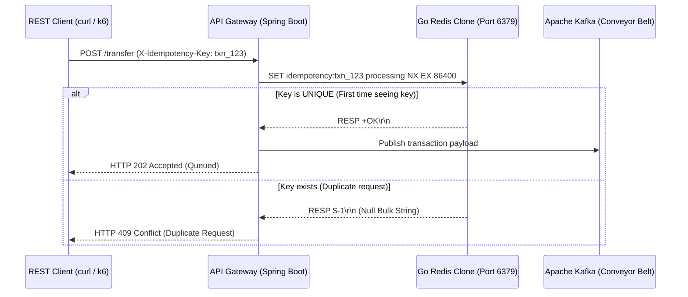

# Redis Integration: Custom Go Clone Specification

This document outlines the requirements and system integration flow between the API Gateway and a custom-built Go Redis clone. Since this is an educational MVP, we only require a specific subset of Redis features to handle idempotency checks.

---

## 1. System Integration Flow

The API Gateway uses Redis strictly as an **Idempotency Filter** to prevent duplicate transactions (double-spending).



---

## 2. Minimal Redis Clone Specifications

For the custom Redis clone to successfully integrate with this Ledger microservice, it must implement the following checklist:

### A. Network & Concurrency
* **TCP Port Binding:** Must listen on port `6379`.
* **Multi-Client Concurrency:** Must handle connections concurrently (e.g., using goroutines) because the Spring Boot API Gateway uses connection pooling.
* **Graceful Disconnects:** Handle connection termination (EOF) without crashing the Go server.

### B. Command Behaviors & Responses

1. **`PING`:** Return `+PONG\r\n`.
2. **`SET key value [NX] [EX seconds] [PX milliseconds]`:**
   * **`NX` (Not Exists):** Return `$-1\r\n` (Null Bulk String) if the key already exists. Return `+OK\r\n` if it was successfully set.
   * **`EX` / `PX` (Expiration):** Evict (delete) the key after the specified duration (e.g., 24 hours).
3. **Handshake Error Handling:** Return a standard Redis error RESP frame (`-ERR unknown command '<command_name>'\r\n`) when encountering unknown metadata queries like `CLIENT`, `COMMAND`, or `HELLO` instead of empty strings, preventing Lettuce client handshake crashes.

---

## 3. Storage & Eviction Implementation (Go Blueprint)

The Go Redis clone can structure its thread-safe storage and active/passive eviction as follows:

```go
type StorageEntry struct {
    Value      string
    ExpiresAt  time.Time
}

var SETs = map[string]StorageEntry{}
var SETsMu sync.RWMutex

// Active Expiration Sweeper Goroutine
go func() {
    for {
        time.Sleep(5 * time.Second)
        SETsMu.Lock()
        for key, entry := range SETs {
            if !entry.ExpiresAt.IsZero() && time.Now().After(entry.ExpiresAt) {
                delete(SETs, key)
            }
        }
        SETsMu.Unlock()
    }
}()
```

---

## 4. Integration Verification Steps

1. Stop the official Redis container:
   ```bash
   docker-compose down redis
   ```
2. Start the custom Go Redis clone on port `6379`.
3. Boot the API Gateway and verify that it connects without connection handshake crashes.
4. Send a transaction request and verify it returns `202 Accepted`.
5. Send the exact transaction request again and verify it returns `409 Conflict`.
